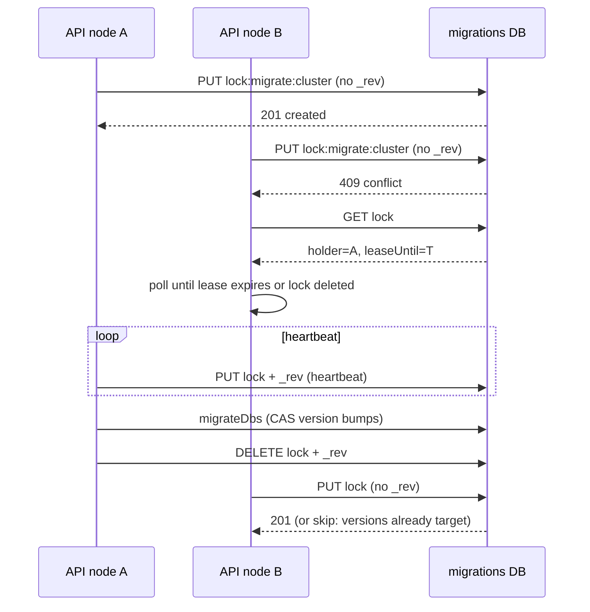

# Migration locking for clustered API startups

This is a **design proposal**, not an implemented feature. It covers how
Conductor should serialise Couch migrations when several API nodes boot (or
run `pnpm run migrate`) against the same Couch cluster at once.

## Why this is needed

A clustered Conductor deploy already runs more than one task
(`autoScaling.desiredCapacity`, sample config `2`). Rolling ECS deploys keep
full healthy capacity (`minHealthyPercent: 100`), so replacement tasks start
**before** old ones drain. Several processes can therefore execute the same
startup / migrate path against one Couch instance.

TTL cleanup was extracted to a **one-shot** Fargate task (`taskCount: 1`) for
exactly this reason — in-process work on every scaled task would race. Schema
migrations have the same shape, but they are heavier and not currently
guarded.

### What actually runs today

| Path | When | What it does | Lock? |
| ---- | ---- | ------------ | ----- |
| `api/src/index.ts` → `validateDatabases` | **Every API process start** | Optionally rewrites project `uiSpecification` (`MIGRATE_NOTEBOOKS_ON_STARTUP`, default **on**); initialises each project data DB | None |
| `pnpm run migrate` → `initialiseAndMigrateDBs` | **Manual / CI / operator** | `initialiseDbAndKeys` then `migrateDbs` for global DBs, then every project **data** DB | None |
| `POST /fallback-initialise`, `/api` initialise routes | Fallback / admin | `initialiseDbAndKeys` only (design docs + keys), not `migrateDbs` | None |

Couch **schema** migrations (`migrateDbs` in
`library/data-model/src/data_storage/migrations/migrationService.ts`) are
**not** run on API listen. The operator guide is explicit: run `pnpm run
migrate` separately. That does **not** make clustering safe:

- Operators (or two deploy hooks) can still launch migrate twice.
- Notebook UI-spec migration **does** run on every API boot.
- A future “migrate on API start” change would make schema races the default
  during every clustered rollout.

The rest of this note assumes we want a lock that covers **schema
`migrateDbs`**, **notebook startup migration**, and any later “migrate on
start” behaviour.

## How `migrateDbs` works today (and where it races)

Per database in the queue:

1. **Lookup** the migrations-DB document by view
   `index/by_dbType_and_dbName` (`[dbType, dbName]`).
2. If none, **`post()`** a default document (Couch assigns a random `_id`).
3. If `version === targetVersion`, skip.
4. Otherwise scan **all** non-design docs in batches of 100, `put`/`remove`
   per doc, then **`put` the migration document** with the new `version` and
   a log entry.

There is no in-progress flag. Version is only advanced after the full scan of
that version step. Two nodes that both observe version `N` will both apply
`N → N+1`.

### Concrete races

**Duplicate status documents.** `post()` has no deterministic `_id`. Two
nodes that miss the view at the same time create **two** status docs for the
same DB. Later queries return an arbitrary row. Version bookkeeping becomes
split-brain.

`writeNewDocument` in `library/data-model/src/data_storage/utils.ts` is also
**not** a create-if-not-exists primitive: it `get`s then `put`s. Two callers
can both see 404 and both `put`. Do not use it for locks.

**Overlapping document transforms.** `performMigration` does
`allDocs` → migrate → `put` with the batch `_rev`. A concurrent migrator:

- Gets **409**; that is recorded as an **issue** and the whole DB migration
  is marked `failure` / `not-healthy`.
- Or wins the `put` while the other still holds a stale copy of a later doc.

**Non-idempotent steps.** Several migrations are not safe to run twice, or
not safe to interleave:

- `invitesV2toV3` sets `expiry: Date.now() + 1 day` and `createdAt: Date.now()`.
- `dataV1toV2` may stamp `updatedAt` with **now** when a head revision is
  missing.
- `invitesV1toV2` / `invitesV2toV3` can **delete** docs.
- `projectsV3toV4` reads a second Couch DB (`metadata-{id}`) and inlines it;
  two writers can persist different `createdAt` / `updatedAt`.

Idempotency is a good **defence in depth**. It is not a substitute for
exclusion: deletes, version bumps, and “mark healthy” are still racy.

**Notebook startup.** `updateProjectUiSpecification` is get-then-put via
`putProjectDoc`. 409 is thrown as a generic system error (not retried). Two
booting API tasks can collide on the same project document.

**No multi-document commit.** Even a single node cannot atomically “migrate all
docs **and** bump version”. The version `put` is the closest thing to a
commit point, and it is a **single document**. Crash between last data `put`
and version bump → next run re-applies the same step (must be idempotent
enough to survive that).

## CouchDB atomicity — what we actually have

Couch has **no** multi-document transactions. `_bulk_docs` is a convenience
batch; each row succeeds or conflicts independently. `_bulk_docs` with
`new_edits: false` is a replication tool, not a lock.

The only compare-and-swap primitive is **MVCC on one document**:

| Primitive | Behaviour | Use for locking? |
| --------- | --------- | ---------------- |
| `PUT` **without** `_rev` of a **known `_id`** | Creates the doc, or **409** if it already exists | **Yes — acquire** |
| `PUT` **with** `_rev` | Succeeds only if that revision is still the winner; else **409** | **Yes — heartbeat, release, steal, version bump** |
| `GET` then `PUT` | Classic TOCTOU | **No** |
| `POST` (server `_id`) | Always creates a new doc | **No** (causes duplicate status docs today) |
| `_update` handler | Server-side get-modify-put; still 409 under contention | Optional sugar; same strength as client CAS |
| `validate_doc_update` | Can reject illegal state transitions | Optional guardrail, not a lock |
| Conflict branches (`conflicts=true`) | Happen if replication or `new_edits: false` creates siblings | Locks must **not** create conflict trees; always CAS the winner |

This codebase already uses create/CAS in a smaller way: download-grant consume
treats a 409 as “someone else won” (`api/src/couchdb/downloadGrants.ts`).
`safeWriteDocument(..., writeOnClash: false)` is the same idea (return
`undefined` on 409) but it first tries `put` of the caller’s body, which may
**overwrite** if `_rev` is absent and the doc is missing — fine for create,
wrong if you meant “update only”.

**Quorum.** On a Couch cluster, a successful `PUT` is acknowledged at the
configured write quorum (default majority). That is enough for a lock as
long as every Conductor node talks to the **same** clustered Couch, not a
sidecar replica with delayed replication. FAIMS deployments use one logical
Couch URL per environment.

**Clocks.** Expiry fields are client timestamps. A short TTL plus NTP skew
will false-steal. Prefer a **long lease + frequent heartbeat** (the heartbeat
is a CAS `PUT` of the lock doc). Steal is: `GET` lock, observe lease expired
**and** CAS-replace. If the holder is still heartbeating, steal 409s.

Couch `_local` docs are node-local and **must not** be used for cluster
locks.

## Options considered

### A. Lock document(s) in the `migrations` DB (proposed)

Shared store every migrator already has. Acquire = `PUT` a well-known `_id`
with no `_rev`. Fits schema migrations, notebook startup, and a future
migrate-on-start.

**This is the recommended approach.** Details below.

### B. Fold the lock into the existing per-DB status document

CAS `status: healthy → migrating` on `migration:{dbType}:{dbName}`.

Pros: one doc per DB; version bump and lock can share a revision. Cons: we
do not have deterministic IDs yet (`post()`); notebook startup has no status
doc; a global “someone is migrating the cluster” lock still needs a separate
id; mixing lease/heartbeat with `migrationLog` is messy.

**Do this as well, in a limited form:** give status docs deterministic IDs
and CAS the version bump. Do **not** use the status doc as the only lock
(startup UI-spec work and “whole run” exclusion need their own keys).

### C. One-shot ECS migrate task (same pattern as TTL cleanup)

Run `node …/migrate.js` as EventBridge/RunTask `taskCount: 1` **before** or
**instead of** migrate-on-start. API tasks only wait until versions match.

This is the right **production orchestration** and should be the default on
AWS. It does **not** replace a Couch lock: CLI vs task overlap, DigitalOcean
/ compose deploys, and `validateDatabases` on every API replica still race.

### D. External lock (Redis, DynamoDB, Postgres advisory)

Strong leases, but new infrastructure for a Couch-only control plane. Reject
unless we already operate that store in every environment.

### E. “Just make migrations idempotent and last-write-wins”

Necessary for crash-retry, insufficient for exclusion (duplicate status
docs, deletes, `not-healthy` from 409s, split version history).

### F. Couch `_update` functions for acquire

Possible later. Same MVCC as client `PUT`; adds a design-doc deployment
dependency. Prefer client CAS first (testable against in-memory Pouch).

## Recommended design

Two document kinds in the existing `migrations` database (`MIGRATIONS_DB_NAME
= 'migrations'`), distinguished by `documentType` so views ignore locks.

### 1. Deterministic status IDs (prerequisite, even without locks)

```text
migration:{dbType}:{dbName}
```

Examples: `migration:PEOPLE:people`, `migration:DATA:data-<projectId>`.

`migrateDbs` must `put` this id on first sight (create-only). If 409, `get`
the winner and continue. Drop `post()`. Update
`index/by_dbType_and_dbName` to ignore docs without `documentType:
'migration'` (or equivalently: only emit when `dbType` **and** `dbName` are
set **and** `documentType === 'migration'`).

This alone fixes split-brain status docs.

### 2. Lock documents

Well-known ids, create-only acquire:

```text
lock:migrate:cluster              # whole initialiseAndMigrateDBs / migrateDbs run
lock:migrate:db:{dbType}:{dbName} # optional finer grain (see below)
lock:notebook-startup             # validateDatabases UI-spec pass
```

Suggested fields:

```ts
type MigrationLockDocument = {
  _id: string; // lock:…
  documentType: 'lock';
  lockKind: 'migrate-cluster' | 'migrate-db' | 'notebook-startup';
  holderId: string; // hostname + pid + random UUID
  fencingToken: string; // UUID; holders abort if GET shows a different token
  acquiredAtMs: number;
  heartbeatAtMs: number;
  leaseUntilMs: number; // heartbeatAtMs + LEASE_MS
  purpose: string; // e.g. 'migrateDbs people v4→v5'
};
```

**Acquire**

1. `PUT` `{_id, …}` **without** `_rev`.
2. **201** → we hold it. Start heartbeat.
3. **409** → `GET`. If lease still valid, **wait / poll**. If lease expired,
   CAS-`PUT` our holder fields with the **existing `_rev`** (steal). 409 on
   steal → another waiter won; poll again.
4. Never `GET` then `PUT` without `_rev`. Never `writeNewDocument`.

**Heartbeat**

Timer (e.g. every 15s) CAS-updates `heartbeatAtMs` / `leaseUntilMs`. Suggested
lease **2–5 minutes**. Data-DB scans can run much longer than a lease; the
heartbeat is what keeps the lock. If heartbeat 409s (stolen or conflict),
**stop mutating data** and do not bump version.

**Release**

CAS-`DELETE` (or `_deleted: true`) with our `_rev`, **only if** `GET` still
shows our `fencingToken`. Best-effort in `finally`. Expired locks are
reclaimed by the next acquire; do not require a living holder.

**Waiters (API boot)**

If a node cannot acquire `lock:migrate:cluster` (or sees a cluster migrate in
progress) it should **not** start a second migrate. For migrate-on-start:

- **Wait** until the lock is gone **and** status docs are at target version
  (poll with backoff + jitter).
- **Fail startup** (or refuse `/` health until ready) if wait exceeds a
  bounded timeout — better than serving mixed-schema traffic.
- Nodes that only serve HTTP can skip holding the lock once versions match.

Notebook startup can wait on `lock:notebook-startup` **or** share the cluster
migrate lock if a schema migrate is already running (schema migrate may
rewrite the same project docs).

### 3. Granularity

**Start with one cluster lock** for `initialiseAndMigrateDBs` / `migrateDbs`.
Reasons:

- The current runner is already sequential over DBs.
- Cross-DB steps exist (`projectsV3toV4` opens `metadata-*`).
- Simpler fencing: one token for the whole run.

**Per-DB locks** are useful later if we parallelise project data-DB
migrations (many `data-*` DBs). They do not replace the cluster lock for
“only one `migrateDbs` invocation”. A waiter that lost the cluster lock should
not start per-DB work.

### 4. Version bump as the commit point

After a successful step `N → N+1`:

1. `GET` status doc `migration:{dbType}:{dbName}`.
2. Assert `version === N` (or `N+1` if a previous crash already committed —
   then skip).
3. CAS-`PUT` `{…, version: N+1, status: 'healthy', migrationLog: […]}`.
4. **409** → `GET` again. If the winner is already `N+1` with success, treat
   as done. If still `N`, retry CAS. If `not-healthy`, do not clobber; surface
   the conflict.

Do **not** use `safeWriteDocument` with `writeOnClash: true` here: last-write-wins
would let a failed node overwrite a successful bump.

Optional: set `status: 'migrating'` on the same CAS as “we are about to apply
`N → N+1`”. Crash recovery: if lock is free and status is `migrating` at
version `N`, re-run that step (idempotent apply) then CAS to `healthy`.

### 5. Document writes during apply

`performMigration` should treat **409** as “reload latest `_rev` and
re-apply the function”, not as a fatal issue — **only while we still hold
the fencing token**. That covers crash-retry and any leftover overlap.

If the migration function is not idempotent on an already-new-shaped doc,
the function must no-op (`action: 'none'`) when it sees the new shape.
Several existing functions already do this (`dataV1toV2` if `updatedAt`
present; auth no-ops). Delete migrations should treat 404 as success.

Re-check the lock (cheap `GET` of the lock id, compare `fencingToken`)
**once per batch**, not per doc.

### 6. Orchestration on AWS (complement, not substitute)

Follow TTL cleanup:

- Optional one-shot Fargate **migrate** task, `taskCount: 1`, invoked on
  deploy (or gated by a flag).
- API replica count stays `> 1`.
- API `validateDatabases` still takes `lock:notebook-startup` (or skips UI
  rewrite if a migrate task is holding the cluster lock).

Until that task exists, the Couch lock is what makes `pnpm run migrate` and
a future migrate-on-start safe.

## Suggested lock acquire flow



## Implementation sketch (when we build it)

Keep the algorithm in `@faims3/data-model` so unit tests can use in-memory
Pouch (same as `migrationService.test.ts`). API startup and `migrate.ts`
call a small wrapper.

1. **Types + ids** in `migrationsDB/types.ts`: `documentType`, lock schema,
   `migrationDocId()`, `lockDocId()`.
2. **Views**: map functions skip non-`migration` docs.
3. **`acquireLock` / `heartbeat` / `releaseLock` / `withMigrationLock`**
   in a new `migrations/lock.ts`. Acquire must be put-without-rev.
   Tests: two concurrent acquires, steal after lease, heartbeat 409 aborts,
   release by non-holder fails.
4. **`migrateDbs`**: deterministic status ids; wrap each DB (or the whole
   run) in `withMigrationLock`; 409-retry in `performMigration`; CAS version
   bump.
5. **`validateDatabases`**: `withMigrationLock({id: 'lock:notebook-startup'})`
   around the UI-spec loop (or skip if cluster migrate lock is held).
6. **API boot policy**: wait-for-ready vs fail; health check should not go
   healthy while waiting on a migrate lock if we later run schema migrate on
   start.
7. **Docs**: this file becomes the spec; operator notes in
   `CouchMigrations.md` / `MetadataMigrationGuide.md`; AWS one-shot task
   when ops want it.

Lease/heartbeat values should be config (`MIGRATION_LOCK_LEASE_MS`, etc.)
with conservative defaults.

## Testing strategy

Pouch memory adapter is enough for CAS behaviour (409 on duplicate `_id`).

- Two overlapping `migrateDbs` on one people DB: only one applies; one status
  doc; target version once.
- Steal after lease with no heartbeat.
- Holder crash before version bump: second holder re-runs and commits.
- `performMigration` 409 on a doc: retry succeeds; not `not-healthy`.
- Lock views do not appear in `by_dbType_and_dbName`.

A live Couch integration test (two Node processes, real 409) is nice-to-have
once the helper exists; not required to prove MVCC if unit tests assert
status codes.

## What this does not solve

- **Mixed app/API schema during rolling deploys** — locking serialises
  writers; it does not make old API code understand new documents. Deploy
  order / compatibility remains an operator problem (see
  `MetadataMigrationGuide.md`).
- **Couch ↔ Couch replication split-brain** if two independent Couch
  clusters both accept writes.
- **Long migrate vs ALB health** — a node holding the lock may need a
  longer start period, or migrate must stay a one-shot task so API tasks
  become healthy quickly.
- **JWT `_node/_local/_config` key push** (`initJWTKeys.ts`) is per-Couch-node
  and already called out as cluster-sensitive; it is separate from migration
  locks.

## Decision summary

| Topic | Proposal |
| ----- | -------- |
| Lock store | Existing `migrations` Couch database |
| Acquire | `PUT` known `_id`, no `_rev`; 409 = someone else holds or we steal via CAS |
| Status docs | Deterministic `_id` `migration:{dbType}:{dbName}`; stop using `post()` |
| Granularity | Cluster lock for a migrate run; per-DB later if we parallelise |
| Commit | CAS version bump on the status doc; 409 means re-read |
| Apply | Per-doc 409 retry; abort if fencing token lost |
| AWS | Keep/add one-shot migrate task like TTL cleanup; lock still required |
| Not used | Redis, `_local` docs, `writeNewDocument`, last-write-wins on status |
